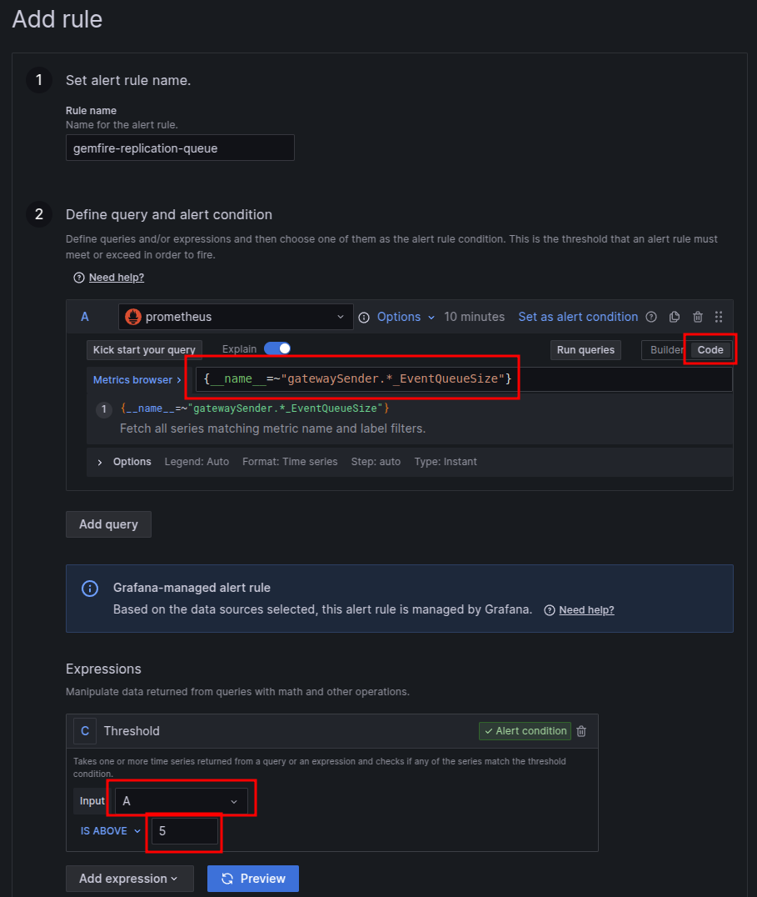
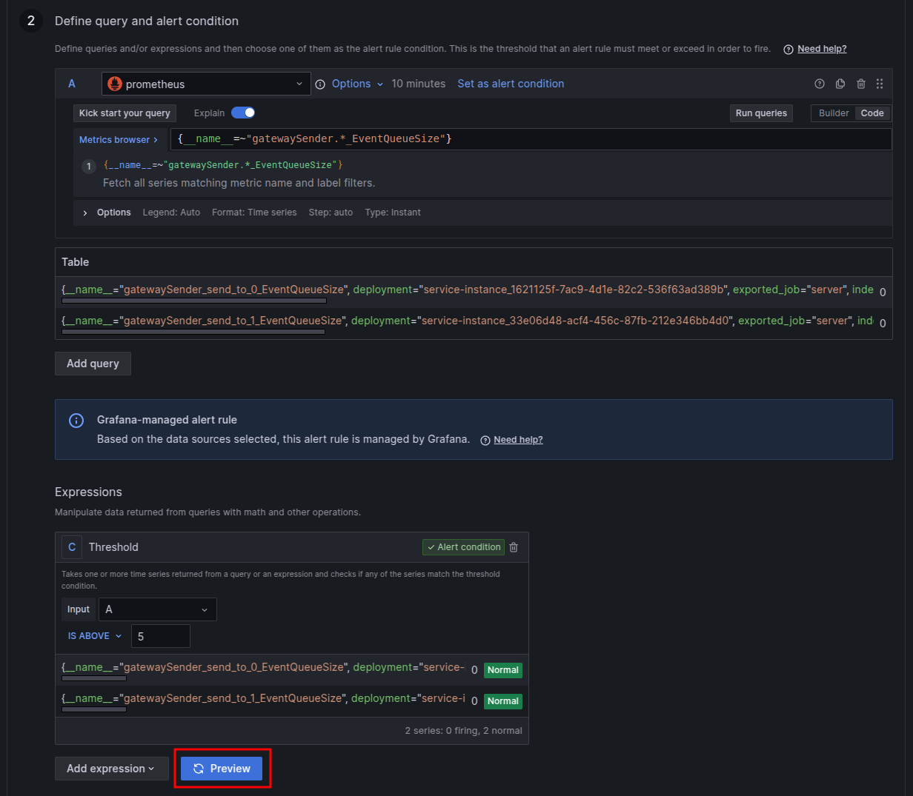

# Monitoring GemFire with Healthwatch 2

To monitor the state of Gemfire replication it is recommended to monitor the Sender Event Size and trigger an alarm if it goes signifficantly over the historical peak.

To achieve this:

- Add a dashboard that allows monitoring historical event queue size
- Setup an alert trigger it it goes signifficantly above the historical queue size

## Viewing the event queue

Add [this dashboard](https://github.com/laidbackware/laidbackware.github.io/blob/main/code-snippits/gemfire-dashboard/gemfire-dashboard.json) to the Healthwatch Grafana instance.

Look at the "Event Queue Size" for the past 7 days and note down how high it goes under steady state. Using discression add an amount on top to define the alerting threshold, e.g. +100%.

## Setting alert triggers

From the hamburger pull out menu expand "Alerting" and click "Alerting rules". Click the "New alert rule" button.

In the dialog fill in section 2:

- Make sure the query it set to "Code" mode
- Paste `{__name__=~"gatewaySender.*_EventQueueSize"}` into the query field
- Delete the "Reduce" expression if present
- Update the "Threshold" expression to have `A` as the "Input"
- The the "Is above" value in the "Threshold" expression to the value derived from the historical queue size

E.g.:

Click the "Preview" button to confirm that the query matches metrics and that all the metrics show as normal.

E.g.:

Continue to fill in the remaining alert settings.

### (optional) Add a lower theshold to know whether to adjust the red alert threshold

Repeat the process above using a lower threshold to trigger a yellow alert, to use as an indicator that the red alert threshold needs to be adjusted.
